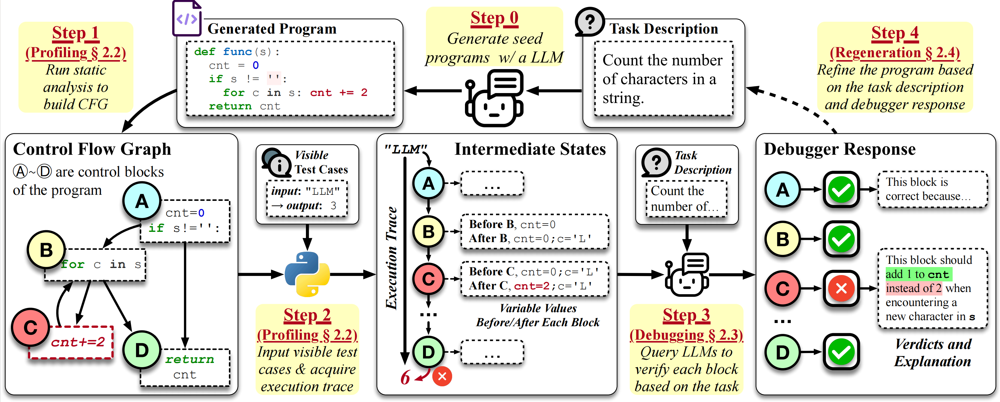

<div align="center"><h1>A Large Language Model Debugger via Verifying Runtime Execution Step by Step</h1></div>

<p align="center">
  <a href="https://arxiv.org/abs/2402.16906">
    
  </a>
  <a href="https://github.com/FloridSleeves/LLMDebugger">
    
  </a>
  <a href="https://huggingface.co/spaces/shangdatalab-ucsd/LDB">
    
  </a>
</p>

This repository contains the code and dataset for our paper [**Debug like a Human: A Large Language Model Debugger via Verifying Runtime Execution Step-by-step**.(ACL 2024)](https://arxiv.org/abs/2402.16906)

We introduce 🛠️**LDB**, a novel debugging framework that enables LLMs to refine their generated programs with the runtime execution information. Specifically, LDB imitates how human developers debug programs. It segments the programs into basic blocks and tracks the values of intermediate variables after each block throughout the runtime execution. This allows LLMs to concentrate on simpler code units within the overall execution flow, verify their correctness against the task description block by block, and efficiently pinpoint any potential errors.

📢 We update [results](https://github.com/FloridSleeves/LLMDebugger/blob/main/results/ldb/humaneval/reflexion/gpt-4o-2024-05-13.jsonl) of LDB on GPT-4o. It achieves accuracy of **98.2%** based on seeds from Reflexion!



## 📦 Installation

```bash
conda create -n ldb python=3.10
conda activate ldb
python -m pip install -r requirements.txt
```

## 📈 Usage

### Set Environment

If you use OpenAI models as backbones:

```bash
export OPENAI_API_KEY=[your OpenAI API Key]
```

If you use `starcoder` or `codellama`, we recommend to setup an OpenAI compatible server based on vLLM. Here is the instruction [Setup vLLM backbones](#setup-vllm-backbones).

### Generate Program Seeds

```bash
cd ./programming
./run_simple.sh [dataset] [model] [output_dir]
```

The result is in `output_data/simple/[dataset]/[model]/[output_dir]`.

Available options:

| Option  | Value                                                                        |
| ------- | ---------------------------------------------------------------------------- |
| dataset | `humaneval`, `mbpp`, `transcoder`                                                                            |
| model   | `gpt-3.5-turbo-0613`, `gpt-4-1106-preview`, `starcoder`, `codellama` (codellama/CodeLlama-34b-Instruct-hf)   |

### Debug Programs

Run the script:

```bash
cd ./programming
./run_ldb.sh [dataset] [model] [seed] [output_dir]
```

The result is in `output_data/ldb/[dataset]/[model]/[output_dir]`

Available options:

| Option  | Value|
| ------- | --------------------------------------------------------------------|
| dataset | `humaneval`, `mbpp`, `transcoder`  |
| model   | `gpt-3.5-turbo-0613`, `gpt-4-1106-preview`, `starcoder`, `codellama` (codellama/CodeLlama-34b-Instruct-hf)|
| seed    | Path to the seed program you want to debug. You can find the seed programs we use in experiments in `input_data/[dataset]/seed/[model]/seed.jsonl`.|

### Setup vLLM backbones

We use the OpenAI compatible server based on vLLM. Please refer [OpenAI-Compatible Server](https://docs.vllm.ai/en/latest/getting_started/quickstart.html#openai-compatible-server) for detailed instructions to setup the local servers. To start the server:
```bash
python -m vllm.entrypoints.openai.api_server --model bigcode/starcoder
```
LDB automatically sets up the connection to your local servers when you specify model `starcoder` or `codellama`.

If your server port is not the default `8000`, please set the option `--port` in `run_simple.sh` or `run_ldb.sh` to your local server port.

### Use LDB API directly
LDB provides APIs for debugging and generating code with the debugging messages:

```
class PyGenerator:
  ldb_debugldb_debug(self, prompt: str, prev_func_impl: str, failed_test: str, entry: str, model: ModelBase, prev_msg: List[Message], dataset_type: str = "", level: str = "block")
  Args:
        prompt (str): Text description or the code to be translated.
        prev_func_impl (str): Implementation of the previous function.
        failed_test (str): One failed test.
        entry (str): Entry point where debugging is initiated.
        model (ModelBase): Model used for debugging. The values could be 'gpt-3.5-turbo-1106', 'gpt-4-1106-preview', 'StarCoder', 'CodeLlama'.
        prev_msg (List[Message]): Previous debugging messages and information.
        dataset_type (str, optional): Type of dataset being processed. The values could be 'HumanEval' for text-to-code tasks, and 'TransCoder' for C++-to-Python translation tasks.
        level (str, optional): Level of debugging to be performed. Default is "block". The values could be 'line', 'block', 'function'.

  ldb_generate(self, func_sig: str, model: ModelBase, messages: List[Message], prev_func_impl: Optional[str] = None, failed_tests: Optional[str] = None, num_comps: int = 1, temperature: float = 0.0, dataset_type: str = "") -> Union[str, List[str]]
  Args:
        func_sig (str): Signature of the function to be generated.
        model (ModelBase): Model used for code generation. Possible values: 'gpt-3.5-turbo-1106', 'gpt-4-1106-preview', 'StarCoder', 'CodeLlama'.
        messages (List[Message]): Debugging messages and information.
        prev_func_impl (str, optional): Implementation of the previous function.
        failed_tests (str, optional): A failed test (this arg is not used in this function).
        num_comps (int, optional): Number of completions to generate. Default is 1.
        temperature (float, optional): Sampling temperature for text generation. Default is 0.0.
        dataset_type (str, optional): Type of dataset being processed. Possible values: 'HumanEval' for text-to-code tasks, 'TransCoder' for C++-to-Python translation tasks. Default is an empty string.
  Returns:
        Union[str, List[str]]: Generated code or list of generated codes.
"""
```
Here is an example for debugging one round:
```
# One round debugging
gen = PyGenerator()
messages = gen.ldb_debug(prompt, code, test, entry_point, model, "", dataset_type, "block")
fixed_code, messages = gen.ldb_generate(
    func_sig=task,
    model=model,
    prev_func_impl=code,
    messages=messages,
    failed_tests=test,
    dataset_type=dataset_type,
)
```
For more details, see the example usage in our [demo](https://huggingface.co/spaces/shangdatalab-ucsd/LDB).

## 🐞 Bugs or Questions?

If you have any questions, feel free to post issues in this repo.

## 📑 Citation

If you find our work helpful, please cite us:
```
@inproceedings{zhong2024debug,
  title={Debug like a Human: A Large Language Model Debugger via Verifying Runtime Execution Step by Step},
  author={Zhong, Li and Wang, Zilong and Shang, Jingbo},
  booktitle={Findings of the Association for Computational Linguistics ACL 2024},
  pages={851--870},
  year={2024}
}

```
## 🙌 Acknowledgement
Our implementation adapts code from [Reflexion](https://github.com/noahshinn/reflexion) and [staticfg](https://github.com/coetaur0/staticfg). We thank authors of these projects for providing high quality open source code!
